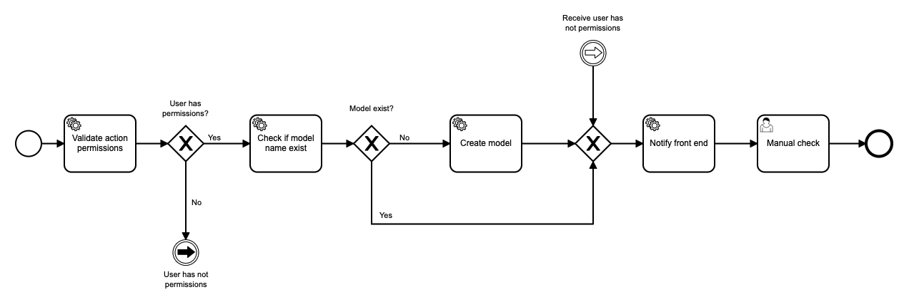
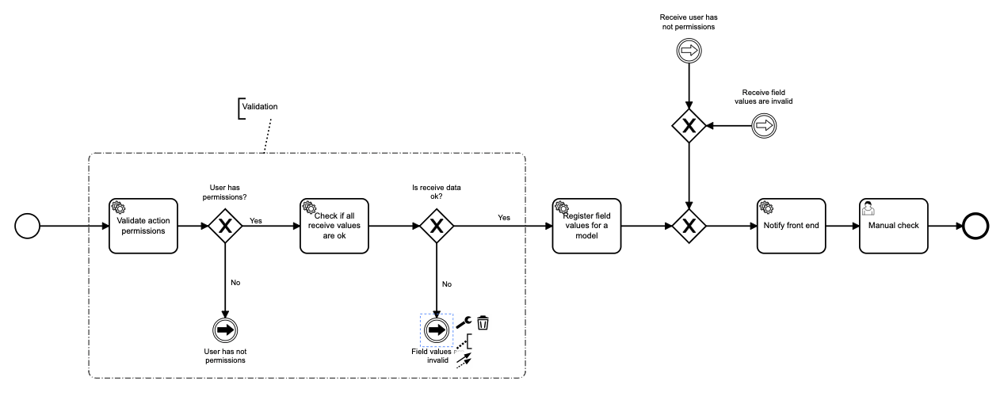

# Alucard project
Alucard provides an HTTP api that allows you to create and manage a dynamic database using the JSON format.

How does it work?
Alucard is a dynamic CRUD. It allows you to create tables for your database through an HTTP request and manage a CRUD http api.

Every action works under the same endpoint (POST)
`http:localhost:3000/api/v1/action`

which receives two parameters `action` and. `payload`

Alucar uses **Kafka** and **Camunda BPMN** to manage the different flows according to the action.
Upon receiving a request, the corresponding kafka event is dispatched, which will start a new instance of the BPM flow.


# Core actions

## Create new table (Model)
```json
// POST - http://localhost:3000/api/v1/action
{
  "payload": {
    "modelName": {
      "value": "User",
      "type": "String"
    },
    "fields": {
    	 "type": "String",
    	 "value": [
    		{
    			"element": "input",
    			"type": "text",
    			"name": "name",
    			"required": true
    		},
    		{
    			"element": "input",
    			"type": "text",
    			"name": "sunname",
    			"required": true
    		},
    		{
    			"element": "input",
    			"type": "number",
    			"name": "tlf",
    			"required": true
    		},
    		{
    			"element": "input",
    			"type": "password",
    			"name": "password",
    			"required": true
    		},
    		{
    			"element": "textarea",
    			"type": "text",
    			"name": "address",
    			"required": false
    		}
	 	]
    	 	
    }
  },
  "action": "CREATE_MODEL"
}
```


## Insert new row in a model

````json

````

# Tasks and Topics

| Title  | Topic  | Description  |
|---|---|---|
|  Validate action permissions | validateActionPermissionTopic  |  allows to verify if the requested action has permissions and if it is logged in |
|  Check if model name exist |  checkIfModelNameExistTopic |  It lets us know if a model exists by name. |
|  Create model | createModelTopic  |  Create a model and create a field instance with model relationship |
| Notify front end | notifyFrontEndTopic | Send a event to the front end application with a message and a payload |
| Check if all receive values are ok | checkIfModelNameExistTopic | Validate if field values are ok for a model, Check some rules like required, value type, length) |
| Register field values for a model | registerFieldValuesTopic | Register a new row for a model creating a new FieldValue entity instance for each field. Should be called after `checkIfModelNameExistTopic` |
